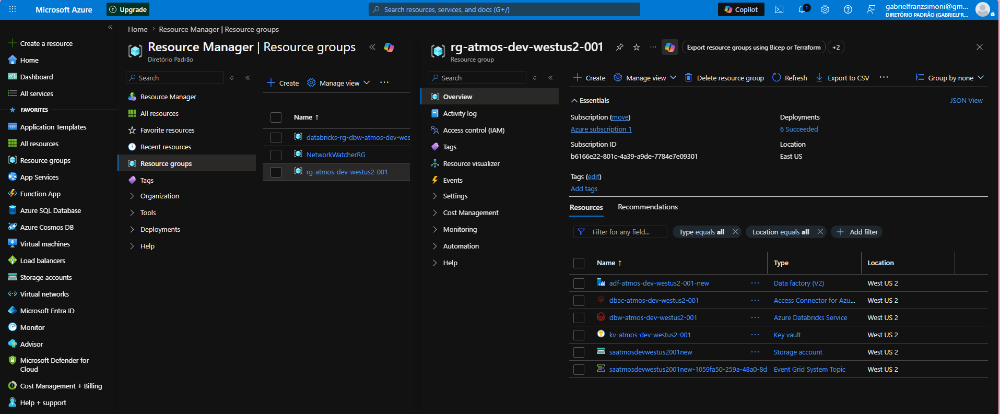
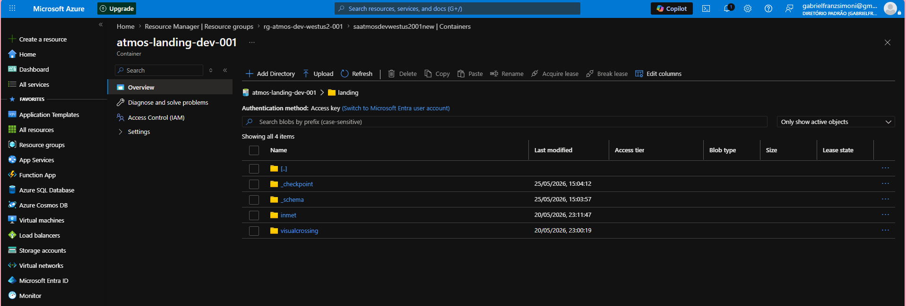
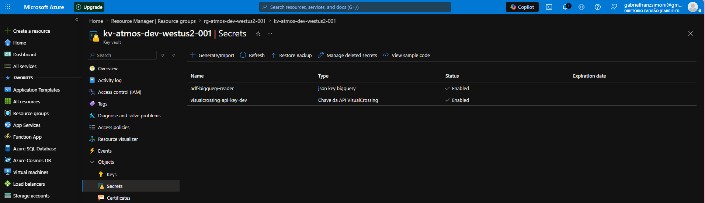
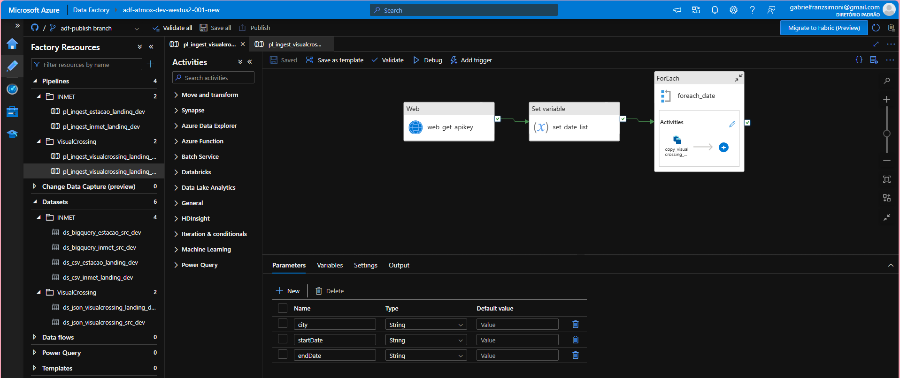

# Atmos ADF ☁️

Pipeline de Engenharia de Dados desenvolvida utilizando Azure Data Factory para orquestração e ingestão automatizada de dados climáticos em uma arquitetura moderna de dados.

---

# 🚀 Objetivo

O projeto tem como objetivo demonstrar a construção de uma pipeline de dados ponta a ponta utilizando Azure Data Factory para ingestão, movimentação e processamento de dados em ambiente cloud.

---

# 🛠️ Tecnologias utilizadas

- Azure Data Factory
- Azure Storage Account
- Azure Databricks
- Azure Key Vault
- Google BigQuery
- Apache Spark
- PySpark
- Delta Lake
- Python
- SQL

---

# 📂 Arquitetura do Projeto

## Ingestão de Dados
- Coleta automatizada de dados climáticos
- Orquestração utilizando Azure Data Factory

## Processamento
- Transformações utilizando Databricks e Spark
- Tratamento e padronização dos dados

## Armazenamento
- Persistência dos dados em Data Lake
- Estruturação em camadas analíticas

---

# 🖼️ Arquitetura e Componentes

## Resource Group



---

## Azure Storage Account



---

## Azure Key Vault



---

## Azure Data Factory Pipeline



---


# ⚙️ Funcionalidades

- Pipelines automatizadas no Azure Data Factory
- Orquestração de fluxos de dados
- Integração com Azure Databricks
- Processamento distribuído com Spark
- Armazenamento em Delta Lake
- Estrutura escalável para projetos de Engenharia de Dados

---

# ▶️ Como executar o projeto

## Clone o repositório

```bash
git clone https://github.com/Gabriel-Franz/atmos-adf.git
